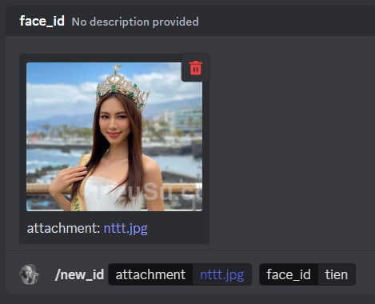
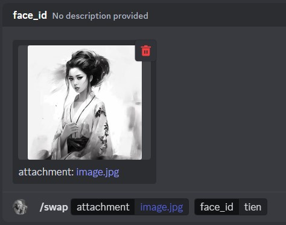
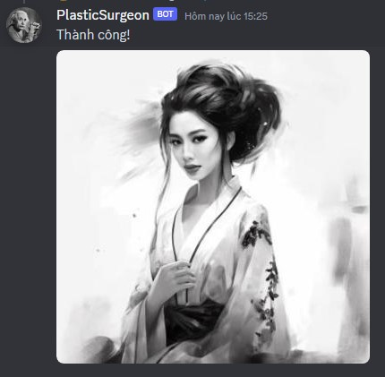
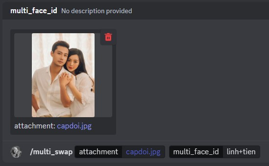
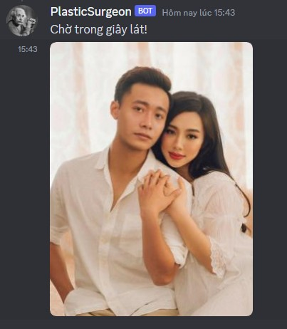
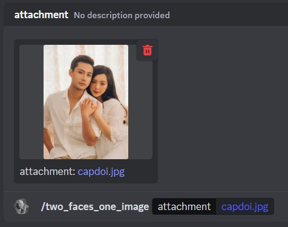
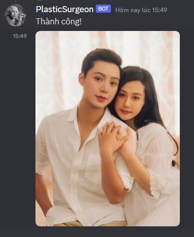

# Swap Face

## User Guide

### /new_id **`upload-ID-image`** **`ID`**
Used to upload and register your own ID photo.
(Front-view, high quality, no glasses, no heavy bangs ID photos are prefered.
    
### /list_id
List all registered identity names, default identity names and prefer options.

### /del_id **`ID`**
Delete specific identity name.

### /del_all_id
Delete all registered names.

### /swap **`upload-image`** **`IDs`**
Replace the face with the registered identity names on target image (Eg: IDs = me+sister)

### /two_faces_one_image **`upload-image`**
Swap faces of two people in one image.

## Step-by-step guide:

1. Invite the Photoshoper bot to the chat room by this link: <https://discord.com/api/oauth2/authorize?client_id=1117016806767472680&permissions=8&scope=bot>.
 
2. Use **`/new_id`** command to register your identity name and feature. The registered name can be any alphabets or numbers up to 8 characters long. If everything goes well, the bot will tell you that the save was successful.

  

3. Use **`/swap`** to replace the face with the registered identity name on target image.

  

4. Complete!

  

5. Besides, it is possible to change many faces at the same time by use **`/multi_swap`**. Each registered id is separated by `+`. Eg: `me+her+him`. Note that the more ids, the longer the waiting time and the number of ids must match the number of people in the image.

  

6. Complete!

  

7. Use **`/two_faces_one_image`** to swap faces of two people in one image. 

  

8. Complete!

  

## Other notes:

1. If there's any problem, please join my Discord group: [DiscordServer](https://discord.gg/CjCwPGb2Z8)
2. Images used are for illustration purposes only.
3. Bot is only made for entertainment and learning purposes, not encouraging actions using bots for bad purposes. I will not be responsible for these acts.
